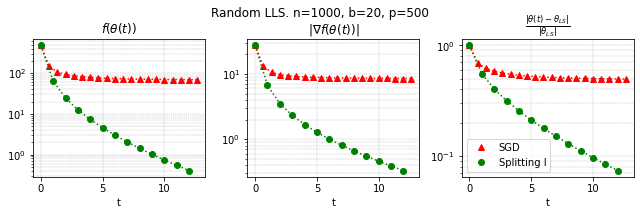

# **STOCHASTIC GRADIENT ALGORITHMS FROM ODE SPLITTING PERSPECTIVE**

COMP6248 Deep Learning Reproducibility Challenge

This repository is created for the Reproducibility Challenge for COMP6248 Deep Learning course. The original paper this project is based on is STOCHASTIC GRADIENT ALGORITHMS FROM ODE SPLITTING PERSPECTIVE published by Daniil M. &amp; Ivan O. published in ICLR 2020 DeepDiffEq.

The experiments in the original work has been successfully reproduced and presented as a report.

**Introduction**

Stochastic Gradient Descent (SGD) is a widely used algorithm used in training of neural networks. The goal of the paper is to use the similarity between SGD approach and first-order splitting scheme for ODE to obtain a more efficient local solver thus achieving better convergence in time and iterations.

 

As can be seen from the graphs above for linear least squares example with generated dataset with the dimensions and batch size mentioned in graph as the step size increases the performance exceeds vanilla SGD algorithm thus proving the claims of the original paper.

And in the graph above we can see the performance of the algorithms in different step sizes for AIRTools II Hansen &amp; Jørgensen (2018) tomography dataset. After a threshold value for the step size the performance of the proposed algorithm outperforms SGD.

Our experimental findings coincide with the experimental results in the paper thus we can conclude that the novel idea in the paper is performing as promised and will have many use cases in machine learning problems.

**Code File Description**

- Upper\_bound\_impractice.ipynb contains the code necessary for the calculation of the global upper bound error.
- [Linear\_Logistic\_Softmax.ipynb](https://github.com/COMP6248-Reproducability-Challenge/STOCHASTIC-GRADIENT-ALGORITHMS-FROM-ODE-SPLITTING-PERSPECTIVE/blob/master/Linear_Logistic_Softmax.ipynb) contains the code necessary for running the three different problems solved by both vanilla SGD and the proposed splitting scheme algorithm.

**Email**

Yasin Erdogan [ye2n19@soton.ac.uk](mailto:ye2n19@soton.ac.uk)

Oguz Erol [oe1n19@soton.ac.uk](mailto:oe1n19@soton.ac.uk)

Arda Berk Kilickaya abk1u19@soton.ac.uk
